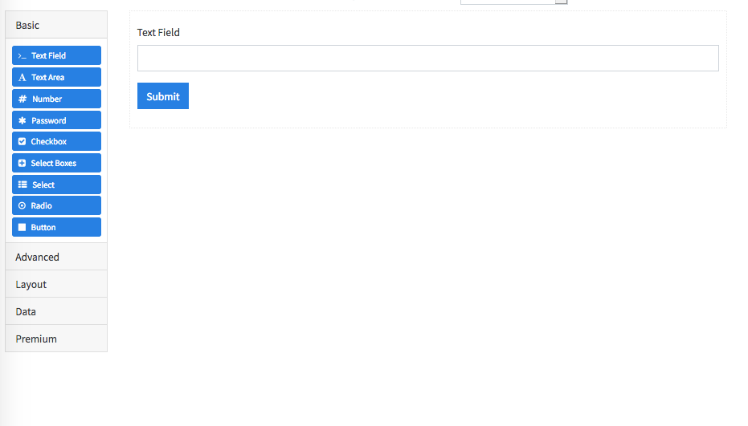
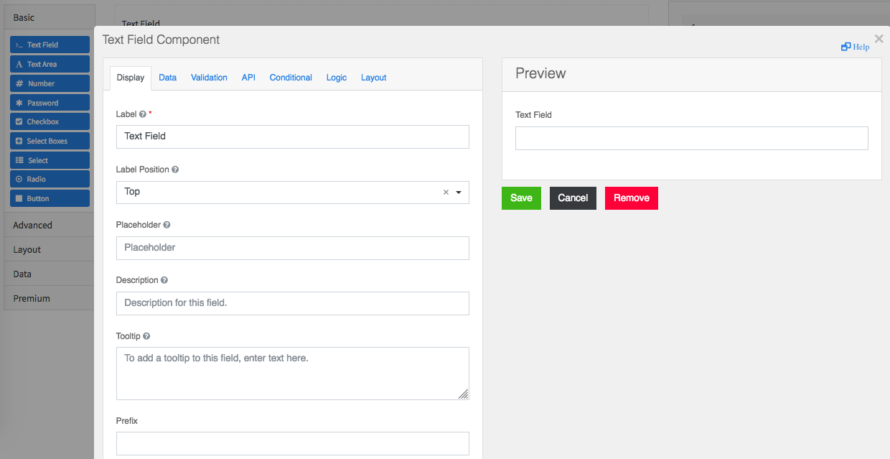
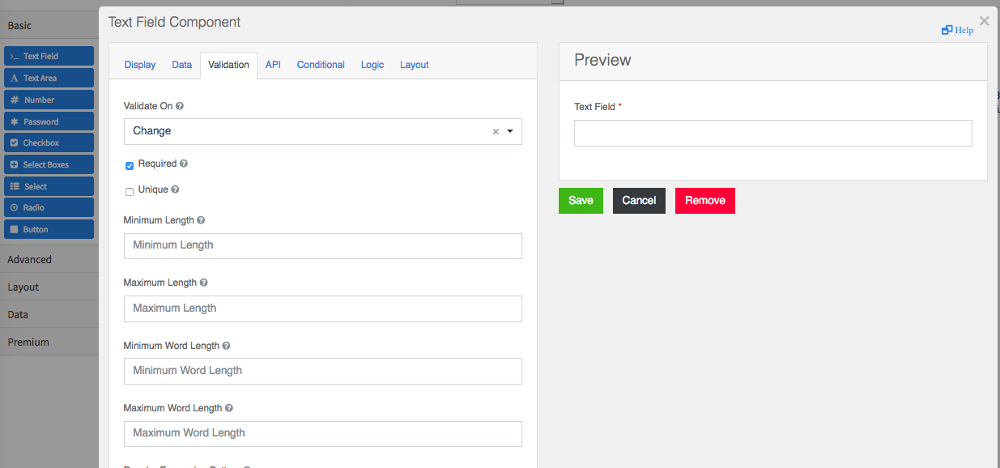
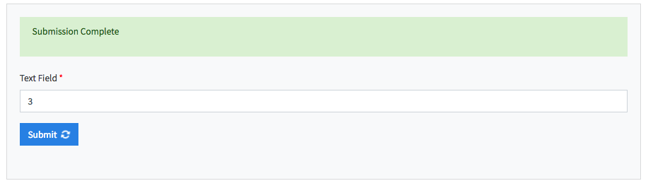
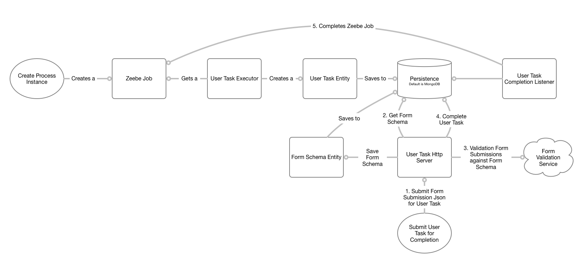

# quintessential-tasklist-zeebe
The quintessential Zeebe tasklist for BPMN Human tasks with Drag and Drop Form builder, client and server side validations, and drop in Form Rendering

WIP

Setup SLF4J logging: `-Dvertx.logger-delegate-factory-class-name=io.vertx.core.logging.SLF4JLogDelegateFactory`

vertx run command: `run com.github.stephenott.MainVerticle -conf src/main/java/com/github/stephenott/conf/conf.json`

Current Zeebe Version: `0.21.0-alpha1`
Current Vertx Version: `3.8.0`
Java: `1.8`


# Cluster Architecture


- Clients, Workers, and Executors can be added at startup and during runtime.
- Failed nodes in the Vertx Cluster (Clients, Workers, and Executors) will be re-instantiated through the vertx cluster manager's configuration. 


# Form Building UI

The Form Builder UI uses Formio.js as the Builder and Render.  
The schema that was generated from the builder is persisted and used during the User Task Submission with Form flow.








And then you can render and make a submission:




## User Task Submission with Form Data flow




# ZeebeClient/Worker/Executor Data Flow


# Configuration

Extensive configuration capabilities are provided to control the exact setup of your application: 

The Yaml location can be configured through the applications config.json.  Default is `./zeebe.yml`. 

Example:

```yaml
zeebe:
  clients:
    - name: MyCustomClient
      brokerContactPoint: "localhost:25600"
      requestTimeout: PT20S
      workers:
        - name: SimpleScriptWorker
          jobTypes:
            - type1
          timeout: PT10S
        - name: UT-Worker
          jobTypes:
            - ut.generic
          timeout: P1D

executors:
  - name: Script-Executor
    address: "type1"
    execute: ./scripts/script1.js
  - name: CommonGenericExecutor
    address: commonExecutor
    execute: classpath:com.custom.executors.Executor1
  - name: IpBlocker
    address: block-ip
    execute: ./cyber/BlockIP.py

userTaskExecutors:
  - name: GenericUserTask
    address: ut.generic

managementServer:
  enabled: true
  apiRoot: server1
  corsRegex: ".*."
  port: 8080
  instances: 1
  zeebeClient:
    name: DeploymentClient
    brokerContactPoint: "localhost:25600"
    requestTimeout: PT10S

formValidatorServer:
  enabled: true
  corsRegex: ".*."
  port: 8082
  instances: 1
  formValidatorService:
    host: localhost
    port: 8083
    validateUri: /validate
    requestTimeout: 5000

userTaskServer:
  enabled: true
  corsRegex: ".*."
  port: 8080
  instances: 1
```

# Zeebe Clients

A Zeebe Client is a gRPC channel to a specific Zeebe Cluster.

A client maintains a set of "Job Workers", which are long polling the Zeebe Cluster for Zeebe Jobs that have a `type` listed in the `jobTypes` array.

Zeebe Clients have the following configuration:

```yaml
zeebe:
  clients:
    - name: MyCustomClient
      brokerContactPoint: "localhost:25600"
      requestTimeout: PT20S
      workers:
        - name: SimpleScriptWorker
          jobTypes:
            - type1
          timeout: PT10S
        - name: UT-Worker
          jobTypes:
            - ut.generic
          timeout: P1D
``` 

Where `name` is the name of the client.  The same name could be used by multiple clients in the same server or by other servers.  The `name` is used as the `zeebeSource` in Executors and User Task Executors as the source system to send completed/failed Zeebe Jobs back to.

Where `workers` is a array of Zeebe Worker definitions.  A worker definition has a `name` and a list of `jobTypes`.

`name` is the worker name that is provided to Zeebe as the worker that requested the job.

`jobTypes` is the lsit of Zeebe job `types` that will be queried for using long polling.

Jobs that are retrieved will be routed to the event bus using the address: `job.:jobType:`, where `:jobType:` is the specific Zeebe job's `type` property.
Make sure you have executors (Polyglot, User Task or custom) on the network connected to the vertx cluster or else the job will not be consumed by a worker.
 
 Take note of the usage of the `timeout` which is the deadline that the job will be locked for. 
 The usage has special applicability for Jobs that you want to use with User Task; where you will want to set the timeout as a much longer period than a typical executor. 


# Executors

Executors provide a polyglot execution solution for completing Zeebe Jobs.

Executors have the following configuration:
Example of three different executors:

```yaml
executors:
  - name: Script-Executor
    address: "type1"
    execute: ./scripts/script1.js
    instances: 2
  - name: CommonGenericExecutor
    address: commonExecutor
    execute: classpath:com.custom.executors.Executor1
  - name: IpBlocker
    address: block-ip
    execute: ./cyber/BlockIP.py
```

Executors can execute scripts and classes as defined in the executor's polyglot capabilities.

Where `address` is the Zeebe job `type` that would be configured in the task in the BPMN.

Where `execute` is the class/script that will be executor when jobs are sent to this executor

Where `name` is the unique name of the Executor used for logging purposes.

You can deploy a Executor with multiple `instances` to provide more more parallel throughput capacity.

Required properties: `name`, `address`, `execute`

Completion of Jobs sent to Executors is captured over the event bus with the JobResult object.  
Completed (successfully or a failure such as a business error) are sent as a JobResult to event bus address: `sourceClient.job-aciton.completion`.

Where `sourceClient` is the ZeebeClient `name` that is used in the `zeebe.clients[].name` property.

The `sourceClient` ensures that a completed job can be sent back to the same Zeebe Cluster, but not necessarily using the same instance of a ZeebeClient that consumed the job.

JobResult's that have a `result=FAIL` will have their corresponding Zeebe Job actioned as a Failed Job.


# User Task Executors

User Task(UT) Executors are a special type of executor that are dedicated to the logic handling of BPMN User Tasks.

UT Executors have the following configuration:

```yaml
userTaskExecutors:
  - name: GenericUserTask
    address: ut.generic
    instances: 1
```

Required properties: `name`, `address`

Where `address` is the Zeebe job `type` that would be configured in the task in the BPMN.

Internally executors have their addresses prefixed with a common job prefix to ensure proper message namespacing.

Where `name` is the unique name of the UT Executor used for logging purposes.

You can deploy a UT Executor with multiple `instances` to provide more more parallel throughput capacity.

UT Executors primary function is to provide capture of UTs from Zeebe and convert the Zeebe jobs into a UserTaskEntity.
A UserTaskEntity is then saved in the storage of choice (such as a DB).

Completion of User Tasks is captured over the event bus with the JobResult object.

Completed (successfully or a failure such as a business error) are sent as a JobResult to event bus address: `sourceClient.job-aciton.completion`.

Where `sourceClient` is the ZeebeClient `name` that is used in the `zeebe.clients[].name` property.

The `sourceClient` ensures that a completed job can be sent back to the same Zeebe Cluster, but not necessarily using the same instance of a ZeebeClient that consumed the job.

JobResult's that have a `result=FAIL` will have their corresponding Zeebe Job actioned as a Failed Job.


## User Tasks

The default build of User Tasks seeks to provide a duplicate or similar User Task experience as Camunda's User Tasks implementation.

See UserTaskEntity.class, UserTaskConfiguration.class for more details.

A User Task can be configured in the Zeebe BPMN using custom headers.  The supported headers are:

|key|value|description|
|------|------|----------|
|title|`string`|The title of the task.  Can be any string value that will be interpreted by the User Task storage system.|
|description|`string` |The description of the task.  Can be any string value that will be interpreted by the User Task storage system.|
|priority|`int`|defaults to 0|
|assignee|`string`|The default assignee of the task. A single value.|
|candidateGroups|`string`|The list of groups that are candidates to claim this task. Comma separated list of strings.  Example: `"cg1, cg2, cg3"`|
|candidateUsers|`string`|The list of users that are candidates to claim this task.  Comma separated list of strings.  Example: `"cu1, cu2, cu3"`|
|dueDate|`string`|The date on which the User Task is due.  ISO8601 format|
|formKey|`string`|A value that represents the specific form that should be used by the user when completing this task.|


When generating a UserTaskEntity, some additional properties are stored for usage and indexing and convenience:

In addition to the custom header values above, the following is stored in the UserTaskEntity:

|key|value|description|
|------|------|----------|
|taskId|`string`|The unique ID of the task.  Typically will be a business centric key defined during configuration.  If not ID is provided then defaults to `user-task--:UUID:` where `:UUID:` is a random UUID.|
|zeebeSource|`string`|The source ZeebeClient `name` that the ZeebeJob was retrieved from.
|zeebeDeadline|`instant`|The Zeebe Job deadline property|
|zeebeJobKey|`long`|The unique job ID of the Zeebe Job.|
|bpmnProcessId|`string`|The BPMN Process Definition ID|
|zeebeVariables|`Map of String:Object`|The variables from the Zeebe Job|
|metadata|`Map of String:Object`|A generic data holder for additional User Task metadata|

# Form Validation Server

The Form Validation Server provides HTTP endpoints for validation a Form Submission based on a provided Form Schema.

Configuration:

```yaml
formValidatorServer:
  enabled: true
  corsRegex: ".*."
  port: 8082
  instances: 1
  formValidatorService:
    host: localhost
    port: 8083
    validateUri: /validate
    requestTimeout: 5000
```

Where `formValidatorService` is the Form Validator service that performs the actual form validation.

Example Validation Request:

POST: `localhost:8083/validate`

Body:

```json
{
    "schema":{
            "display": "form",
            "components": [
                {
                    "label": "Text Field",
                    "allowMultipleMasks": false,
                    "showWordCount": false,
                    "showCharCount": false,
                    "tableView": true,
                    "alwaysEnabled": false,
                    "type": "textfield",
                    "input": true,
                    "key": "textField2",
                    "defaultValue": "",
                    "validate": {
                        "customMessage": "",
                        "json": "",
                        "required": true
                    },
                    "conditional": {
                        "show": "",
                        "when": "",
                        "json": ""
                    },
                    "inputFormat": "plain",
                    "encrypted": false,
                    "properties": {},
                    "customConditional": "",
                    "logic": [],
                    "attributes": {},
                    "widget": {
                        "type": ""
                    },
                    "reorder": false
                },
                {
                    "type": "button",
                    "label": "Submit",
                    "key": "submit",
                    "disableOnInvalid": true,
                    "theme": "primary",
                    "input": true,
                    "tableView": true
                }
            ],
            "settings": {
            }
        },
    "submission":{
    "data": {
        "textField2": 123,
        "dog": "cat"
    },
    "metadata": {}
}
}
```

Response if validation passes:

```json
{
    "processed_submission": {
        "textField2": "sog"
    }
}
```

Notice that the extra `dog` property is removed because it is not a valid field in the form schema.

Response if validation fails:

```json
{
    "isJoi": true,
    "name": "ValidationError",
    "details": [
        {
            "message": "\"textField2\" must be a string",
            "path": "textField2",
            "type": "string.base",
            "context": {
                "value": 123,
                "key": "textField2",
                "label": "textField2"
            }
        }
    ],
    "_object": {
        "textField2": 123,
        "dog": "cat"
    },
    "_validated": {
        "textField2": 123
    }
}
```

The validation service is also available over the event bus at the `address` property defined in the Form Validation Server configuration.


# Management Server

The management server provides HTTP endpoints for working with Zeebe clusters

Configuration:

```yaml
managementServer:
  enabled: true
  apiRoot: server1
  corsRegex: ".*."
  port: 8080
  zeebeClient:
    name: DeploymentClient
    brokerContactPoint: "localhost:25600"
    requestTimeout: PT10S
  instances: 1
  fileUploadPath: ./tmp/uploads
```

required fields: `apiRoot`, `zeebeClient`

`apiRoot` must be unique.

## Deploy Workflow

`POST localhost:8080/server1/deploy`

Headers:
- `Content-Type: multipart/form-data`

form-data:
- file name (must be a .bpmn or .yaml file) : file upload (the binary file you are uploading such as a .bpmn file)

Where `server1` is the `apiRoot` value defined in the YAML configuration.

You can deploy many management servers as needed.  Each server can be deployed for different zeebe clusters.

You can deploy the same server with multiple `instances` to provide more throughput. 

## Create Workflow Instance / Start Workflow

`POST localhost:8080/server1/create-instance`

Headers:
- `Content-Type: application/json`
- `Accept: application/json`

Json Body:

```json
{
  "workflowKey": 1234567890
}
```

Where `workflowKey` is the unique workflow key that was generated for the BPMN process/pool during deployment.

You may also use:

```json
{
  "bpmnProcessId": "myProcess",
  "bpmnProcessVersion": 2
}
```

Where `bpmnProcessId` is the BPMN's process Id property (sometimes referred to as a process key).
The `bpmnProcessVersion` is optional.  You can set the version number or set as `-1` which means "latest version" / newest.  If you do not provide the property it will default to latest version.

`varaibles` can also be provided as a json object:

```json
{
  "workflowKey": 1234567890,
  "variables": {
    "myVar1": 123,
    "myVar2": "some value",
    "myVarABC": [1,2,5,10],
    "myVarXYZ": {
        "1": "A",
        "2": "B"
    }
  }
}
```

The variables will be injected into the created workflow instance.


# User Task Server

A User Task HTTP server that provides User Task persistence, querying, completion, etc.

The server also provides a Form Schema Entity persistence, querying, and validation of submissions against the schema. 
The Form Schema is what will be submitted to the Form Validator Service.

## Server Configuration

```yaml
userTaskServer:
  enabled: true
  corsRegex: ".*."
  port: 8080
  instances: 1
```

## Actions:

1. Save Form Schema
1. Complete User Task
1. Get User Tasks
1. Submit Form to Complete a User Task
1. Delete User Task (TODO)
1. Claim User Task (TODO)
1. UnClaim User Task (TODO)
1. Assign User Task (TODO)
1. Create Custom User Task (not linked to Zeebe Job)

## Save Form Schema

POST `/form/schema`

```json
{
  "owner": "Department-1",
  "key": "MySimpleForm1",
  "title": "My Simple Form 1",
  "schema": {
    "display": "form",
    "components": [
      {
        "label": "Text Field",
        "allowMultipleMasks": false,
        "showWordCount": false,
        "showCharCount": false,
        "tableView": true,
        "alwaysEnabled": false,
        "type": "textfield",
        "input": true,
        "key": "textField2",
        "defaultValue": "",
        "validate": {
          "customMessage": "",
          "json": "",
          "required": true
        },
        "conditional": {
          "show": "",
          "when": "",
          "json": ""
        },
        "inputFormat": "plain",
        "encrypted": false,
        "properties": {},
        "customConditional": "",
        "logic": [],
        "attributes": {},
        "widget": {
          "type": ""
        },
        "reorder": false
      },
      {
        "type": "button",
        "label": "Submit",
        "key": "submit",
        "disableOnInvalid": true,
        "theme": "primary",
        "input": true,
        "tableView": true
      }
    ],
    "settings": {
    }
  }
}
```

The `key` property is the `formKey`  value you setup in your zeebe task custom headers.

Required fields: `owner`, `key`, `title`, `schema`


## Complete User Task

Mainly used as a administrative endpoint to complete a User Task without any Form

POST `/task/complete`

```json
{
  "job": 2251799813685292,
  "source": "MyCustomClient",
  "completionVariables": {}
}
```

`Source` is the zeebe client name configured in your configuration yaml.


## Get Tasks

GET `/task`

JSON Body:

Query is run as a `AND` query on each of the arguments

```json
{
  "taskId": "",
  "state": "",
  "title": "",
  "assignee": "",
  "dueDate": "",
  "zeebeJobKey": "",
  "zeebeSource": "",
  "bpmnProcessId": ""
}
```

You can pass `{}` as the body if you want to return all User Tasks.


## Submit Task with Form

POST `/task/id/:taskId/submit`

Example: `localhost:8088/task/id/user-task--080946c6-1355-4cd7-9fcf-86fc9c46d4c4/submit`

Json Body:

```json
{
    "data": {
        "textField2": "sog",
        "dog": "cat"
    },
    "metadata": {}
}
```

This endpoint acts the same as the Validation Server's `/validate` endpoint.  The difference is the User Task's endpoint will complete the User Task entity in the DB if the form is valid, and the Form fields will be saved in the Zeebe workflow as variables when the Job is completed.

Upon successful form validation, and assuming the User Task is not already completed, then the User Task will be made complete and the completion variables will be saved. 
Then a background worker is watching for completed user tasks and will attempt to report this back to the Zeebe Job.  
The behaviour is this way so you can complete User Tasks without having to have a active connection to the Zeebe Cluster.

## Delete User Task

TODO...


## Claim User Task

TODO...

## UnClaim User Task

TODO...

## Assign User Task

TODO...

## Create Custom User Task (not backed by Zeebe Job)

TODO...

----

# Raw Notes

1. Implements clustering and scaling through Vertx instances.
1. ZeebeClientVerticle can increase in number of instances: 1 instance == 1 ZeebeClient Channel connection.
1. ExecutorVerticle is independent of ZeebeClient.  You can scale executors across the cluster to any number of instances and have full cluster feature set.
1. a JobResult is what holds the context of if a Zeebe Failure should occur in the context of the actual Work that a executor preformed.
1. Management HTTP takes a apiRoot namespace which is the prefix for the api calls to deploy and start process instances
1. TODO: Add a send message HTTP verticle
1. UserTaskConfiguration is the data that is received from a Zeebe Custom Headers which is used to generate the Entity
1. UserTaskVerticle is a example of a custom worker.  I have made them individual so User Tasks can be managed as stand along systems
1. The Client Name property of the Client config is used as the EB address namespace for sending job completions back over the wire
1. TODO move executeBlocking code into their own worker verticles with their own thread pools
1. sourceClient is passed over the wire as a header which represents the client Name.  The client name is the client (or any instance of that name/id) that is used to send back into zeebe.  This supports multiple clients to different brokers (representing tenants for data separation)
1. Breakers needs to be added
1. Polling for Jobs is a executeBlocking action.  When polling is complete (found jobs or did not find jobs), it will call the poll jobs again.  It assumes long polling is enabled.
1. TODO review defaults and setup of entity build in the user task verticle as its very messy right now.
1. Management Server uses the route namespacing because it is assumed that security will be added by a proxy in the network.  If app level security needs to be added, then the ManagementHttpVerticle can be easily copied and replaced with security logic.
1. TODO move EB addresses in a global static class for easy global management
1. TODO fix up the logging to be DEBUG and cleanup the language as the standard is all over the place at the moment.  Also inlcude more context info for when reading the log as its unclear.
1. TODO ***** Add the defaults logic for the User Task assignments, where if the headers that are not provided in zeebe then the user tasks entity will default to those configured values.
1. TODO add the overrides logic: where if a override is provided then only the logic from the override is used and the provided header does not matter
1. TODO Refactor error handling on HTTP requests to provider better json errors

```xml
...
<bpmn:extensionElements>
    <zeebe:taskDefinition type="ut.generic" retries="3"/>
    <zeebe:taskHeaders>
        <zeebe:header key="title" value="my user task1" />
        <zeebe:header key="assignee" value="stephen" />
        <zeebe:header key="formKey" value="myCustomForm" />
    </zeebe:taskHeaders>
</bpmn:extensionElements>
...
```
