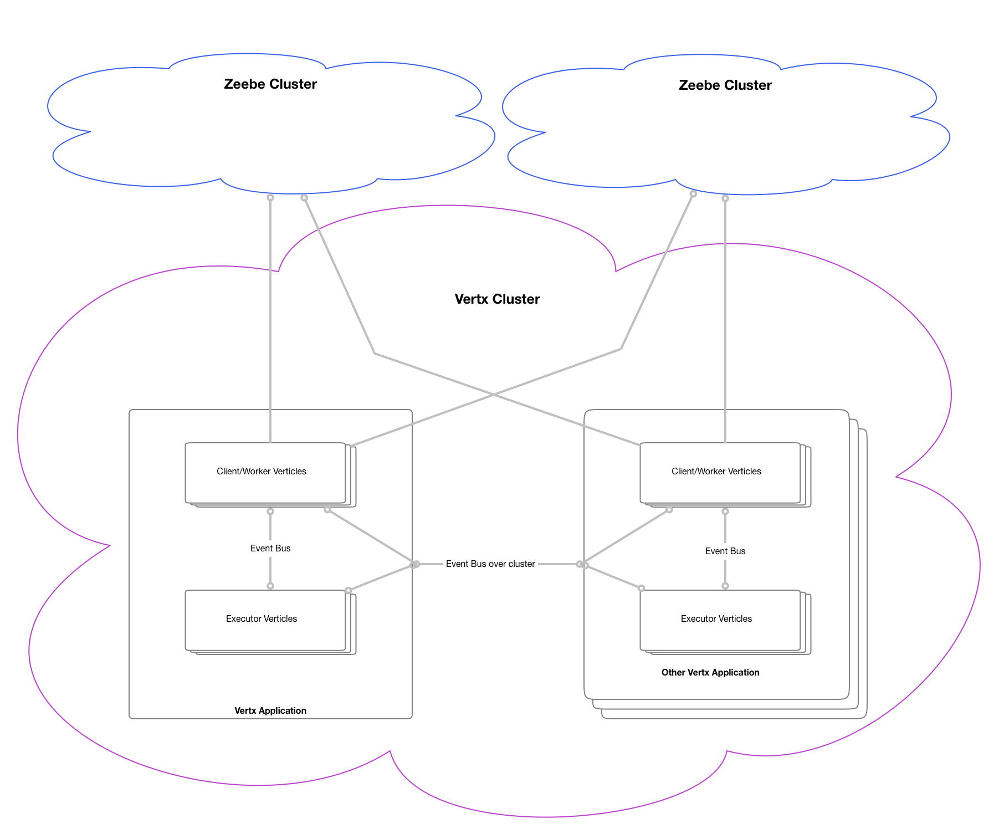
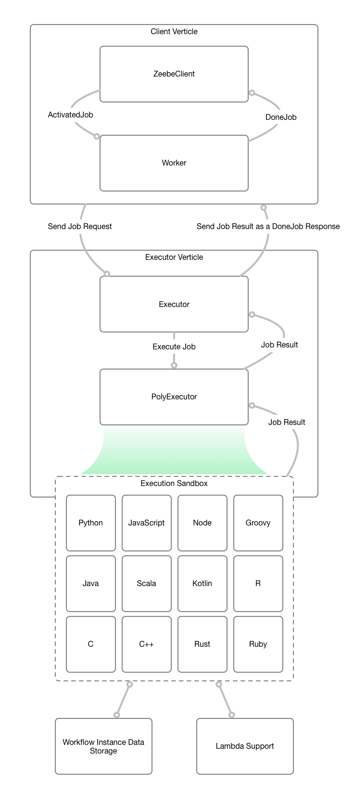

# quintessential-tasklist-zeebe
The quintessential Zeebe tasklist for BPMN Human tasks with Drag and Drop Form builder, client and server side validations, and drop in Form Rendering

WIP

Setup SLF4J logging: `-Dvertx.logger-delegate-factory-class-name=io.vertx.core.logging.SLF4JLogDelegateFactory`

vertx run command: `run com.github.stephenott.MainVerticle -conf src/main/java/com/github/stephenott/conf/conf.json`

Current Zeebe Version: `0.21.0-alpha1`
Current Vertx Version: `3.8.0`
Java: `1.8`

# Components

1. Vertx ZeebeClient verticle (leverages the io.zeebe.client lib).  This manages the ZeebeClient and Zeebe's Worker concept.
1. Executor verticle which executes the work/jobs consumed by the Worker.
1. Compartmentalization of a ActivatedJob for sending over the wire (Event bus).
1. Human Task API.
1. Zeebe Worker work execution capability for polyglot / multiple languages.

# Cluster Architecture



- Zeebe Worker design to support a Vertx Cluster that have 1-N Zeebe Clients that can connect to 1-N Zeebe Clusters.
- Zeebe Workers support clustering of 1-N, the same design as the Zeebe Clients.  Workers are independent of Clients.
- Clients and Workers can be added at startup and during runtime.
- Failed nodes in the Vertx Cluster (Clients or Workers) will be re-instantiated through the vertx cluster manager's configuration. 
- Vertx Applications may choose to only run as a Worker within the cluster, and do work for other clients.

# ZeebeClient/Worker/Executor Data Flow



# Configuration

Extensive configuration capabilities are provided to control the exact setup of your application:

- Multiple clients can be configured through `zeebe.clients` array.
- Each client represent a ~persistent gRPC channel (see Zeebe's Java Client for details).
- Workers (`zeebe.clients[].workers`) can be defined per client.  A Worker is the long polling of Zeebe jobs based on the job type.
- Jobs returned by workers will be routed through the event bus using the `Common.JOB_ADDRESS_PREFIX`. Default prefix is `job.`.
- Executors are what actually consumes the jobs that were consumed by ZeebeWorkers.
- Executors have a event bus `address` which uses the `Common.JOB_ADDRESS_PREFIX` as the prefix to the `address` value.
- A Executor's `execute` value is the destination of the script or class that will be executed in order to consume the Job.
- A executor will return a `DoneJob` object that contains the result (COMPLETE, FAIL) of the execution, retries, and any variables to be sent back into Zeebe on reporting the Job complete or fail.
- Clients can be established without the need to establish executors, as there may be executors on other applications in the Cluster.
- Executors can be established without the need to establish ZebeeClients. 

The Yaml location can be configured through the applications config.json.  Default is `./zeebe.yml`. 

Example:

```yaml
zeebe:
  clients:
    - name: MyCustomClient
      brokerContactPoint: "0.0.0.0:25600"
      requestTimeout: 60000
      workers:
        - name: MyWorker
          jobTypes:
            - type1
            - myCustomType
executors:
  - name: Script-Executor
    address: type1
    execute: ./scripts/script1.js
  - name: CommonGenericExecutor
    address: commonExecutor
    execute: classpath:com.custom.executors.Executor1
  - name: IpBlocker
    address: block-ip
    execute: ./cyber/BlockIP.py
```


# Notes

1. Implements clustering and scaling through Vertx instances.
1. ZeebeClientVerticle can increase in number of instances: 1 instance == 1 ZeebeClient Channel connection.
1. ExecutorVerticle is independent of ZeebeClient.  You can scale executors across the cluster to any number of instances and have full cluster feature set.